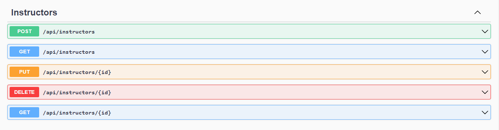
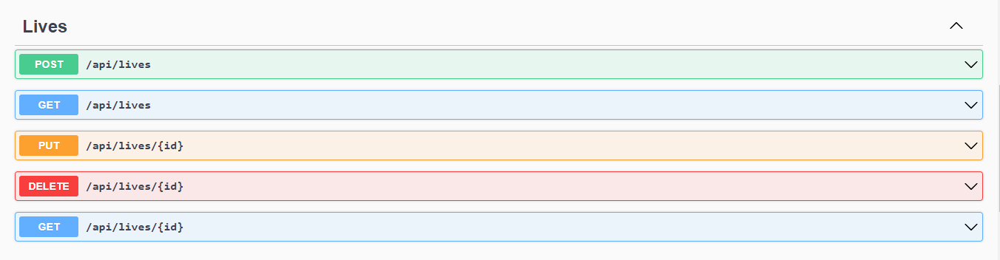
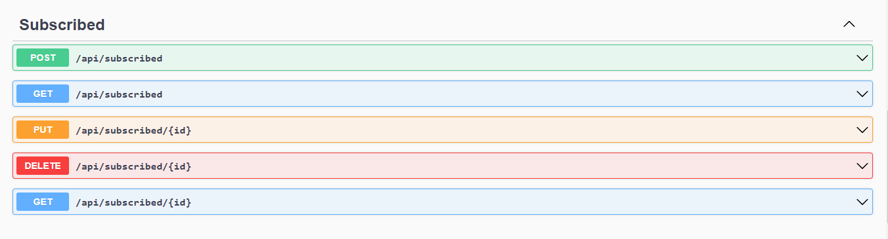
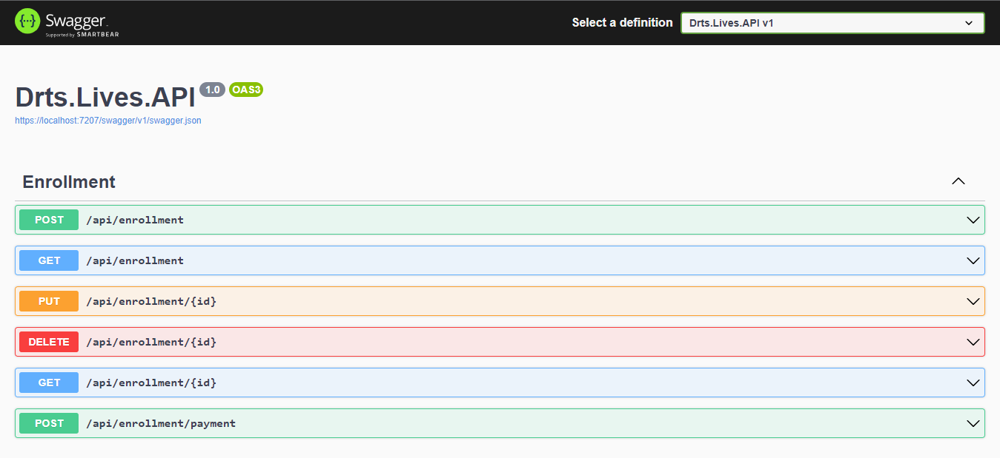

---

## Drts.Lives.API

---

## ℹ About this repository
The objective of this repository is to demonstrate the application developed to improve my knowledge about REST API using DDD modeling.

This project consists of a lives management API,
allowing CRUD to be carried out for the following operations:

- Instructors
- Lives
- Enrollment

Additionally, there is a dedicated endpoint for making registration payments.

---
## 👁️ Preview
---
## Instructor

---

## Lives

---

## Subscribed

---

## Enrollment

---

## 📝 Notes
This project presents some areas that can be improved, and I am already working on them. For example, I'm creating a generic base interface to avoid repeating code. Additionally, I plan to implement JWT authentication soon.

---

## 🧪 Technologies
This project was developed using the following technologies:

- [.Net Core v8.0]
- [Entity Framework Core v8.0]
- [PostgreSQL v15]

---
</> Developed by [João Duarte](https://github.com/joaodrts) 👋
---